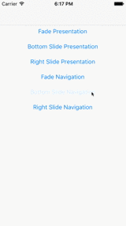

# Animators

[](https://travis-ci.org/anton-plebanovich/Animators)
[](http://cocoapods.org/pods/Animators)
[](http://cocoapods.org/pods/Animators)
[](http://cocoapods.org/pods/Animators)

Custom animators for presentation and navigation transitions. Super simple to use! Just call one of two configuration methods to setup navigation or presentation animations.

## Example

To run the example project, clone the repo, and run `pod install` from the Example directory first.

## GIF animation

Bottom Slide:




Fade:


Right Slide:


## Installation

#### Carthage

Please check [official guide](https://github.com/Carthage/Carthage#if-youre-building-for-ios-tvos-or-watchos)

Cartfile:

```
github "APUtils/Animators"
```

#### CocoaPods

Animators is available through [CocoaPods](http://cocoapods.org). To install
it, simply add the following line to your Podfile:

```ruby
pod 'Animators'
```

## Usage

To setup presentation animation call configuration before controller presentation, usually in `awakeFromNib()`. Like that:

```swift
override func awakeFromNib() {
    super.awakeFromNib()
    
    FadeAnimationDelegate.configurePresentationAnimations(viewController: self)
}
```

To setup navigation animation call configuration before controller push. You could do it in **navigation controller's root view controller** `viewDidLoad()` method or just before push.

```swift
override func viewDidLoad() {
    super.viewDidLoad()
    
    RightSlideAnimationDelegate.configureNavigationAnimations(navigationController: navigationController!)
}
```

```swift
FadeAnimationDelegate.configureNavigationAnimations(navigationController: navigationController!)
let vc = ViewController.create(type: .none)
navigationController?.pushViewController(vc, animated: true)
```

See example and test projects for more details.

## Contributions

Any contribution is more than welcome! You can contribute through pull requests and issues on GitHub.

## Author

Anton Plebanovich, anton.plebanovich@gmail.com

## License

Animators is available under the MIT license. See the LICENSE file for more info.
